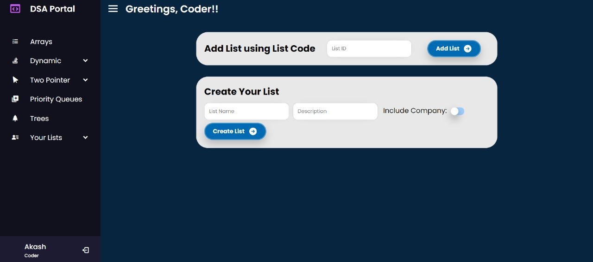

  

  <h3 align="center">DSA Portal</h3>
  

    "Empower Your Learning with DSA Portal: Your Dynamic Solution for Managing DSA Question Lists!"
     
     
  

## Table Of Contents

* [About the Project](#about-the-project)
* [Technologies Used](#technologies-used)
* [Features](#features)
* [Getting Started](#getting-started)
  * [Prerequisites](#prerequisites)
  * [Installation](#installation)
* [Contributing](#contributing)
* [Authors](#authors)
* [Project Images](#project-images)

## About The Project

DSA Portal is a dynamic Java web application designed to streamline the management of Data Structures and Algorithms (DSA) question lists. It aims to enhance the learning experience of students by automating the tracking of solved questions and providing a centralized database for easy recall. DSA Portal eliminates the need for manual tracking systems, allowing students to focus more on learning rather than administrative tasks.

## Technologies Used

DSA Portal is built using a variety of technologies, including:
- **Java Servlets**: Provides the backbone for handling HTTP requests and responses.
- **JDBC (Java Database Connectivity)**: Enables interaction with the MySQL database.
- **MySQL**: Stores and manages the DSA question lists and related data.
- **HTML**: Defines the structure of web pages.
- **CSS**: Styles the HTML elements for improved presentation.
- **JavaScript**: Enhances interactivity and user experience on the web pages.

## Features

- **Automated Tracking**: DSA Portal automates the tracking of solved questions, reducing the need for manual record-keeping.
- **Centralized Database**: A centralized MySQL database ensures easy access to DSA question lists from anywhere.
- **Intelligent Marking**: The platform intelligently marks completed questions and allows for embedding comments, facilitating collaborative learning.
- **User-Friendly Interface**: DSA Portal offers an intuitive and user-friendly interface for seamless navigation and interaction.

## Getting Started

To get started with DSA Portal, follow these steps:

### Prerequisites

- Java Development Kit (JDK)
- Apache Tomcat Server
- MySQL Database Server

### Installation

1. Clone the DSA Portal repository.
2. Set up your MySQL database and configure the JDBC connection in the application.
3. Deploy the application on Apache Tomcat Server.
4. Access the application through a web browser.

## Contributing

Contributions are welcome! Follow these steps to contribute to the project:

1. Fork the project.
2. Create your feature branch.
3. Commit your changes.
4. Push to the branch.
5. Open a pull request.

## Authors

* **Akash Srivastava** - *Web Developer*

## Project Images 

    

        
         
        
Login Page

    

     
    

        
         
        
Home Page

    

     
    

        
         
        
Question List

    

     
    

        
         
        
User List

    

